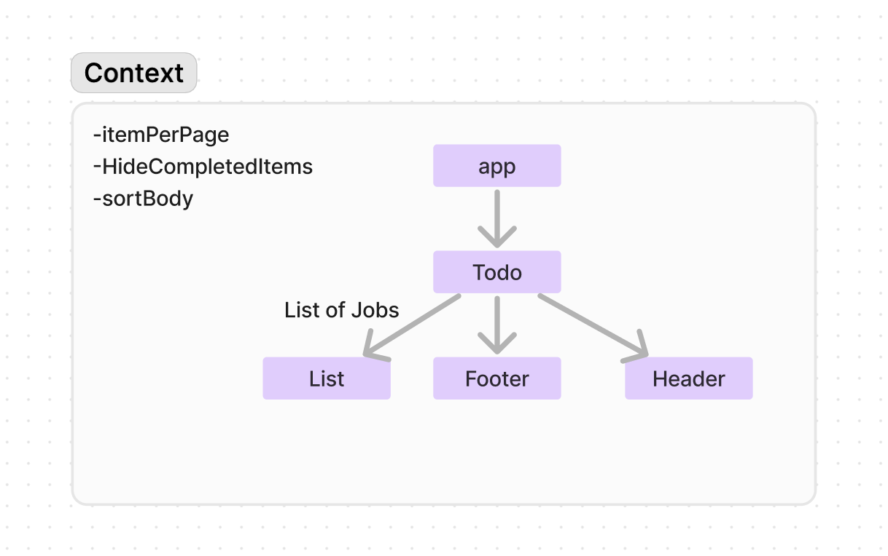

# Context-API

**Author**: Brendan McMullen
**Version**: 1.0.1

## Overview
This app allows the user to create a list of tasks and mark them as complete.

## Getting Started
Enter the name of job and the person it is assigned to. You may also toggle whether completed jobs are shown and the number of jobs per page.

## Architecture
    "@mantine/core": "^7.10.1",
    "@mantine/hooks": "^7.10.1",
    "@tabler/icons-react": "^3.5.0",
    "react": "^18.2.0",
    "react-dom": "^18.2.0",
    "sass": "^1.77.4",
    "uuid": "^10.0.0"

## Credit and Collaborations
chatgpt

## UML Diagram

